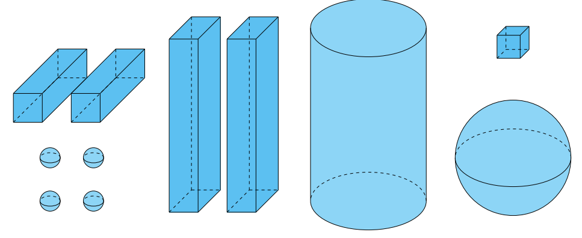

# **OmniCare:** Robô Hospitalar

Trabalho de Interação Humano-Robô (IHR) apresentado ao Centro Universitário [FEI](https://portal.fei.edu.br/), como parte dos requisitos necessários para aprovação na disciplina de Interação Humano-Robô (IHR) (CCR230) do curso de Engenharia de Robôs, orientado pelo Prof. Dr. [Fagner de Assis Moura Pimentel](https://github.com/fagnerpimentel).

## Componentes do Grupo
- Julia Biazi Pisok - 11.124.224-4 - Eng. de Controle e Automação
- Leonardo Santos de Andrade Quirino - 11.121.422-7 - Eng. de Robôs
- Lucas Ricardo Moraes Lagoeiro - 11.120.316-2 - Eng. de Robôs
- Thiago Travagini Moura - 11.121.329-4 - Eng. de Controle e Automação

## Resumo

O protótipo OmniCare é um robô móvel omnidirecional, autônomo e modular, projetado para transportar materiais entre andares em hospitais utilizando elevadores. A proposta visa contornarlimitações de soluções que dependem da integracão como sistema interno dos elevadores. O robô conta com uma estrutura compacta e adaptável, equipada com manipulador cartesiano para acionar fisicamente os botôes.

## Introdução

Nos últimos anos, a robótica tem desempenhado um papel fundamental no desenvolvimento de soluções tecnológicas voltadas para a saúde, com o objetivo de melhorar a eficiência hospitalar e reduzir riscos para os profissionais. Aplicações como a cirurgia assistida por robôs, a reabilitação e terapia robóticas e o uso de robôs em ambientes hospitalares, como no transporte de equipamentos, têm sido amplamente adotadas. Essas tecnologias têm permitido intervenções mais precisas, maior agilidade no atendimento e uma significativa redução no tempo de recuperação dos pacientes. 
E no cenário pós-pandêmico, a automação hospitalar tem ganhado destaque como uma ferramenta de apoio à rotina clínica e operacional. Contudo, um desafio técnico recorrente é a limitação dos robôs móveis em realizarem tarefas logísticas entre diferentes andares, já que a maioria das soluções atuais depende da integração com o sistema interno dos elevadores, algo muitas vezes inviável.

Omnicare é um robô móvel omnidirecional, autônomo e modular, com capacidade de interagir fisicamente com elevadores comuns por meio de um manipulador que aciona os botões necessários para a navegação entre andares.

Navegar em diferentes andares de um hospital para auxilar a equipe do local.

O robô deve proporcinar uma experiência segura e confiavél.

## Publico Alvo

Equipe que trabalha no hospital.
  

### Personas

- Descreva as personas que irão interagir com o robô. Deixe claro suas principais caracteristicas e contextos sociais, econômicos e culturais.
- Quais informações sobre o usuário o robô deve saber antes de iniciar a tarefa?

**1ª Persona: Dra. Mariana Alves – Coordenadora de Enfermagem**

Identidade
  - Nome: Mariana Alves;
  - Idade: 38 anos;
  - Estado civil: Casada, três filhos;
  - Formação: Enfermagem com especialização em Gestão Hospitalar;
  - Local de trabalho: Hospital geral de médio porte;
  - Personalidade: Prática, responsável, comprometida com a segurança e o bem-estar da equipe e dos pacientes;

Status
  - Persona Primária

Objetivos
  - Garantir eficiência no transporte de materiais entre setores e andares;
  - Reduzir a sobrecarga da equipe de enfermagem em tarefas logísticas;
  - Melhorar a agilidade e segurança nos processos internos do hospital;
  - Aumentar o tempo disponível da equipe para atendimento direto aos pacientes.

Habilidades
  - Graduação em enfermagem com mestrado em órteses;
  - Experiência em gestão de equipes multidisciplinares;
  - Conhecimento em protocolos de biossegurança hospitalar;
  - Capacidade de organizar fluxos de trabalho em ambientes de alta demanda;
  - Boa adaptação a novas tecnologias, desde que tragam benefícios claros à equipe.
  
Tarefas
  - Supervisionar e organizar turnos e funções da equipe de enfermagem;
  - Garantir que materiais e equipamentos cheguem no tempo certo aos setores;
  - Solucionar problemas logísticos do dia a dia (falta de insumos, atrasos em entregas internas);
  - Avaliar se novas soluções tecnológicas são viáveis na rotina da equipe.

Relacionamentos
  - Equipe de enfermagem: principal elo, responsável por executar muitas das tarefas operacionais;
  - Gestores hospitalares: reporta indicadores e sugere melhorias, influencia em decisões de adoção de tecnologias;
  - Equipe de apoio logístico: trabalha em conjunto para transporte de insumos;
  - Médicos: depende da rapidez logística para atender às demandas clínicas;
  - Pacientes: impacto indireto — melhor logística significa mais tempo e qualidade no atendimento;
  - Principal responsável por coordenar a equipe de enfermagem e garantir o bom fluxo de materiais e equipamentos dentro do hospital;
  - Atua como decisora de rotina operacional, mas não necessariamente na compra de tecnologias (pode influenciar gestores).

1° Mapa de empatia

**2ª Persona: Carlos Mendes – Gerente Administrativo Hospitalar**

Identidade
  - Nome: Carlos Mendes;
  - Idade: 45 anos;
  - Estado civil: Solteiro, dois filhos;
  - Formação: Administração com MBA em Gestão Hospitalar;
  - Local de trabalho: Hospital privado de grande porte;
  - Personalidade: Analítico, orientado a resultados, focado em custo-benefício e eficiência operacional;

Status
  - Persona Primária.  

Objetivos
  - Reduzir custos operacionais ligados à logística interna;
  - Garantir eficiência no transporte de insumos, sem precisar contratar mais pessoal;
  - Minimizar riscos trabalhistas relacionados ao esforço físico de transporte manual;
  - Tornar o hospital referência em inovação tecnológica e automação hospitalar.

Habilidades
  - Graduação em enfermagem com mestrado em órteses;
  - Gestão financeira e análise de retorno sobre investimento (ROI);
  - Planejamento estratégico de processos hospitalares;
  - Capacidade de negociação com fornecedores e parceiros tecnológicos;
  - Visão sistêmica para equilibrar inovação, custo e aplicabilidade real.
  
Tarefas
  - Avaliar propostas de novas tecnologias para o hospital;
  - Monitorar indicadores de eficiência operacional (tempo de entrega de materiais, custos de pessoal);
  - Coordenar melhorias de infraestrutura hospitalar;
  - Aprovar investimentos em automação e soluções inovadoras.

Relacionamentos
  - Diretoria hospitalar: reporta resultados financeiros e propõe inovações;
  - Equipe de enfermagem e médica: depende de feedback deles sobre eficiência logística;
  - Equipe de TI e manutenção: garante integração, suporte e funcionamento das novas soluções.;
  - Fornecedores de tecnologia: negocia aquisição, contratos de manutenção e suporte;
  - Pacientes (indiretamente): busca melhorar a experiência por meio de processos mais ágeis e eficientes.

2° Mapa de empatia

**3ª Persona: Enzo Ferreira – Estagiário de Enfermagem**

Identidade
  - Nome: Enzo Ferreira;
  - Idade: 26 anos;
  - Estado civil: Solteiro;
  - Formação: Graduando em Enfermagem;
  - Local de trabalho: Hospital universitário de médio porte;
  - Personalidade: Curioso, esforçado, adaptável, mas ainda inseguro em algumas situações práticas;

Status
  - Persona Secundária  

Objetivos
  - Aprender na prática e ganhar experiência no ambiente hospitalar;
  - Ajudar a equipe sem comprometer o cuidado com os pacientes;
  - Ser reconhecido como alguém dedicado e colaborativo;
  - Reduzir erros e evitar situações que exponham sua falta de experiência;
  - Mostrar interesse por novas tecnologias para se destacar.

Habilidades
  - Boa disposição física para deslocamentos e atividades práticas;
  - Rápida adaptação a mudanças e novos processos;
  - Familiaridade com tecnologias digitais (apps, sistemas, automação);
  - Capacidade de aprender observando e executando sob supervisão.
  
Tarefas
  - Apoiar a equipe de enfermagem em tarefas logísticas e administrativas;
  - Acompanhar transporte de medicamentos, materiais e exames;
  - Auxiliar em rotinas básicas de cuidado direto com pacientes;
  - Aprender protocolos de biossegurança e fluxo hospitalar;
  - Observar o funcionamento de tecnologias e sistemas do hospital.

Relacionamentos
  - Enfermeiros supervisores: principais responsáveis por sua formação prática;
  - Médicos residentes: contato frequente durante rotinas de enfermagem;
  - Pacientes: vínculo indireto, ajudando em tarefas simples;
  - Colegas estagiários: troca de experiências e aprendizado conjunto.

Mapa de empatia

## Contexto de uso
O OmniCare foi projetado para interagir em ambientes hospitalares, como hospitais, clínicas e centros de saúde, onde há grande fluxo de pessoas e rotinas sensíveis ao tempo. Nesse espaço, o robô precisa lidar com corredores movimentados, elevadores, diferentes andares e áreas de acesso restrito, sempre respeitando as regras de higiene, segurança e silêncio que caracterizam o ambiente hospitalar. A sua presença deve ser discreta e eficiente, auxiliando a equipe de saúde em tarefas logísticas como entrega de medicamentos e materiais, sem atrapalhar o trabalho humano.

No aspecto social, o robô se insere em um ambiente onde há pacientes em situações de vulnerabilidade, profissionais que trabalham sob pressão e familiares que muitas vezes estão preocupados. Por isso, a interação deve transmitir confiabilidade, empatia e neutralidade, de modo que seja visto como um aliado e não como um intruso. Já no aspecto econômico, a implementação do OmniCare está ligada à busca dos hospitais por otimização de recursos, redução de custos e aumento da eficiência. A automação de tarefas repetitivas libera tempo dos profissionais de saúde para atividades que exigem atenção humana, contribuindo para um melhor uso da equipe disponível. Culturalmente, o ambiente hospitalar exige respeito à privacidade, dignidade e protocolos estabelecidos, além de adaptação às diferentes formas de comunicação, considerando a diversidade linguística e cultural dos pacientes e colaboradores.

Para atuar de forma eficaz, o OmniCare deve conhecer previamente informações sobre o hospital em que está inserido. É essencial que tenha acesso ao mapeamento do espaço, incluindo plantas dos andares, localização de corredores, salas e elevadores, além de distinguir áreas públicas das restritas. Também deve compreender a infraestrutura de mobilidade, como dimensões de portas e regras de circulação, e estar atento às condições dinâmicas do ambiente, como a movimentação constante de pessoas, macas e cadeiras de rodas. Além disso, precisa ter informações operacionais, como horários de entrega de medicamentos, prioridades de cada tarefa e protocolos de segurança no transporte de itens sensíveis. Por fim, é fundamental que reconheça quem são os usuários autorizados a interagir com ele, quais idiomas deve utilizar e quais são os diferentes níveis de acesso, garantindo que sua atuação seja eficiente, segura e adequada ao contexto hospitalar.

## Jornada do usuário

- Criar uma narrativa para o o seu robô e o usuário.
- Determine o passo a passo que o usuário realiza desde o primeiro até o último encontro com robô na realização da tarefa.
- O que está acontecendo com o ambiente quando o robô está interagindo com o usuário?
  - Descreva o que acontece ou pode acontecer passo a passo
  - Como a tarefa começa? Como a tarefa evolui? Como a tarefa termina?
- Enfatize todos os momentos em que acontece uma interação verbal, não-verbal e espacial.

## Análise de concorrência

**TUG / T3 - Aethon**

TUG / T3 é uma linha consolidada de AMRs hospitalares que auxiliam em transporte de medicamentos, roupas, refeições, amostras etc. Ele é capaz de trabalhar com elevadores por meio de um sistema de integração por meio de interface com as controladoras do prédio

- Forças: implantado em muitos hospitais, modelos voltados para cargas grandes, suporte comercial, técnico e de experiência de integração com TI hospitalar.
- Fraquezas: depende de integração com a infraestrutura do hospital, e tambám há relatos públicos sobre a vulnerabilidades de segurança dos sistemas de robôs AMRs

Quando comparado ao Omnicare, é notavél a sua superioridade no quesito de maior suporte para carregamento de cargas, porém ele perde ao precisar ser integrado ao sistema do hospital para se locomover entre andares.

**Athena 2.0 — Slamtec**

A Athena 2.0 é plataforma robótica móvel de uso geral, comunmente usada em logística, hotéis, hospitais e fábricas. Além de ser capaz de suportar transporte de cargas de até 60 kg, esse robô conta com o Smart Elevator Control 4.0, um sistema que se integra digitalmente aos elevadores, permitindo chamadas, monitoramento e deslocamento entre andares.

- Forças: boa capacidade de carga para porte médio, navegação SLAM avançada com LiDAR, detecção de obstáculos, mapeamento de múltiplos andares, autonomia de até 19 horas, e disponibilidade comercial.
- Fraquezas: depende de integração eletrônica com elevadores, risco de falhas de compatibilidade ou de comunicação entre sistemas.

Omnicare apresente uma superioridade à Athena 2.0 por não precisar de um sistema integrado para utilizar elevadores, porém ele perde quando olhamos para a autonomia de 19 horas da Athena 2.0.

**Moxi — Diligent Robotics**

Moxi é robô assistente social desenvolvido para hospitais com foco em aliviar a carga de trabalho de enfermagem e corpo clínico. Faz isso por meio de entregas internas de suprimentos, medicamentos, kits e materiais leves. Apesar de um design mais "humano", ele não pode utilizar elevadores por meio de contato físico, no lugar conta com um sistema de integração.

- Forças: design humanizado e social, experiência comprovada em ambientes hospitalares, foco em tarefas que liberam tempo da equipe de enfermagem.
- Fraquezas: capacidade de carga limitada,ddependência de integração com elevadores, menor versatilidade em relação a tarefas industriais ou de transporte pesado.

O Moxi tem uma grande vantagem em relação ao Omnicare no quesito de aceitação social e o foco na experiência de usuários humanos, enquanto o OmniCare aposta em versatilidade técnica. Isso dá ao OmniCare vantagem em hospitais com infraestrutura mais antiga e a vantagem de suportar mais carga.

## Design

- Pense nas características de Affordances do seu robô. Que tipo de acessibilidades devem ser consideradas dentro do seu projeto?
- Discuta o papel das expectativas do usuário no projeto de um robô. Qual a importância e pontos a serem considerados se você quiser vender esse robô  seu robô?
- O seu robô tem um padrão com mais ou menos características antropomórficas? Qual padrão é mais aceito pela sociedade dentro do projeto que você está desenvolvendo?
- Quais o design mais apropriado para o robô deste projeto? Modele o seu robô com desenhos de formas primitivas (caixas, cilindros, esferas)

<!--  -->
<!--  -->
URDF do Omnicare:

URDF do Manipulador do Omnicare:

## Ações do robô

- Para cada ação:
  - Descreva a ação.
  - Determine os pré-requisitos para que a ação aconteça
  - Determine o que se espera que seja modificado no ambiente quando a ação é finalizada

## Interações do robô

### Espacial

- Para cada interação:
  - Descreva a interação.
  - Determine os pré-requisitos para que a interação aconteça
  - Determine espera de resposta emocional do usúario quando a interação é finalizada

### Verbal

- Para cada interação:
  - Descreva a interação.
  - Determine os pré-requisitos para que a interação aconteça
  - Determine espera de resposta emocional do usúario quando a interação é finalizada

### Não-verbal

- Para cada interação:
  - Descreva a interação.
  - Determine os pré-requisitos para que a interação aconteça
  - Determine espera de resposta emocional do usúario quando a interação é finalizada

[^1]: Fonte: Adaptado de <https://hazeshift.com.br/mapa-de-empatia/>

# Aula 4
## Tarefa 1

- Qual é a situação de uso para a IHR do seu robô?
  Transporte de itens e assitente de informação 
  - Contexto:
    O contexto principal analisado foi em um ambiente hospitalar.
  
  - Usuário(s):
    Os principais usuários são os funcionarios do hospital (Setor logistico, medicos, enfermeiros e etc.), os pacientes e também prestadores de serviços no hospital. Levando em conta principlamente as pessoas com qualquer tipo de dificuldade fisica, mental ou psicologica.
  
  - Objetivos:
    Auxiliar no transporte de cargas dentro do hospital de forma segura para os pacientes, prestadores de serviços e funcionários e também fornecer informações sobre o hospital.
  
  - Interação:
    Comunicação entre os funcionários para definir o que deve ser feito, interação social com todas as pessoas que frequentam o ambiente hospitalar e comunicação com os pacientes e prestadores de serviço do hospital para fornecer informações.

  - Interface e Sistema:
    Fiquei com duvida nesse topico

- Como inserir o seu robô em um contexto cotidiano para aprimorar a solução de um problema?
  É possível inserir o nosso robô dentro dos hospitais para servir de transportadores de cargas, realizando interações verbais e não verbais com todas as pessoas desse ambiente, podendo fornecer informações e repcionar os pacientes

- Onde seus usuários interagem com seu Robô?
  Robô utilizado para transporte de materiais que precisam de um maior cuidado (material infeccioso, alimentos, documentos ou remédios). Nesse caso o robô terá um uso mais interno do hospital onde suas principais interações serão com funcionários e prestadores de serviços com uma movimentação menor de pacientes. Esse uso fica com maior enfase em interagir com os responsaveis pela carga a ser transportada e com os destinatários dessas cargas (Farmácia, centros de exames, centros de coleta, lixeira e etc.). Também tem a interação com os pacientes onde o robo pode se comunicar com eles e fornecer informações e solicitar algumas tarefas como chamar o medico, guiar pelo hospital e etc.

